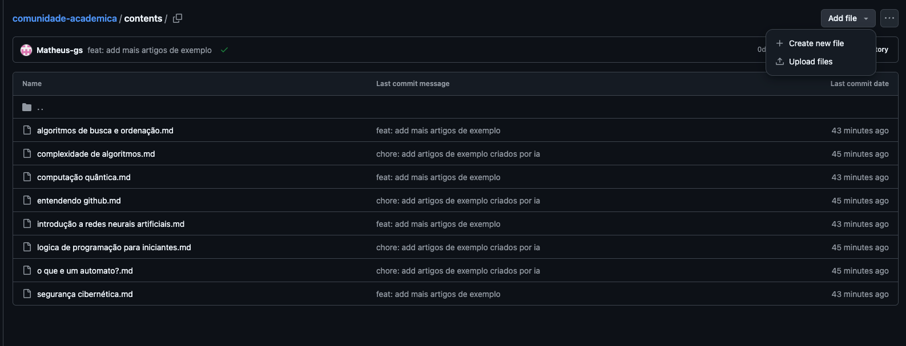
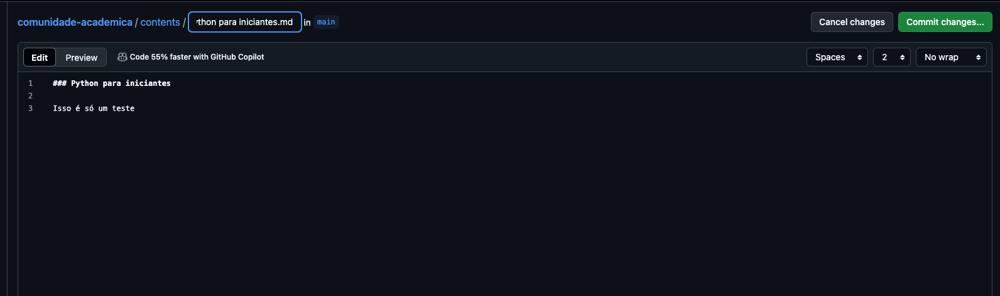
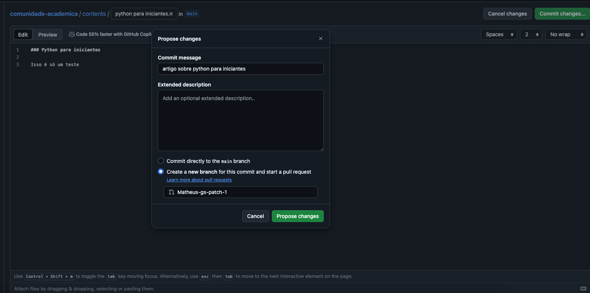
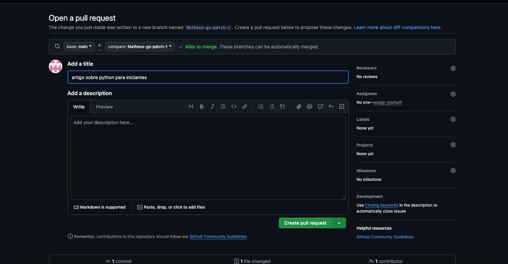

# Comunidade Acadêmica (A.K.A KDHUB)

### Esse trabalho foi parte da disciplina de projetos de linguagem de programação do Centro Universitário do Distrito Federal, idealizado por:

- [Prof Kadidja Valeria](https://github.com/Kadidjah)
- [Raphael Veras - 28253671](https://github.com/Rapah2002)
- [Lucas Simões - 26447070](https://github.com/lucmenn)
- [Matheus Gomes - 26136805](https://github.com/Matheus-gs)
- [Herick Neris - 25851471](https://github.com/hericknerisr)
- [Ezequiel Magalhães - 28256131](https://github.com/EzequielMagalhaes)

### Requisitos

- [vscode](https://code.visualstudio.com/)
- [Live Server](https://marketplace.visualstudio.com/items?itemName=ritwickdey.LiveServer)

### Como rodar o projeto

- Instale o vscode
- Instale a extensão live server no vscode
- Clone o projeto e entre na pasta raiz
- Pressione o botão "Go Live" no canto inferior direito do vscode
- Acesse: [http://127.0.0.1:5500/index.html](http://127.0.0.1:5500/index.html)

Dúvidas? [Clique aqui](https://drive.google.com/file/d/1HWLBdB53N0ozXath9q3I-XUHnPAGxoHL/view?usp=sharing)

# Como contribuir

Dentro da pasta [contents](https://github.com/Matheus-gs/comunidade-academica/tree/main/contents) adicione um arquivo de extensão `.md`, para isso, clique em "Add file" e em seguida em "Create new file"

Dê um nome para o seu conteúdo e escreva o que desejar compartilhar, no nosso caso escolhemos `python para iniciantes.md`

Quando quiser publicar, clique em `commit changes...` e adicione uma breve descrição sobre o seu texto, após isso selecione a opção `Create a new branch for this commit and start a pull request` e clique em `propose changes`

Crie um pull request e peça revisão para o mantenedor do repositório, após revisão, seu artigo será publicado em nosso site 🚀

### Sugestões ou melhorias?

Consulte o guia [entendendo github](https://github.com/Matheus-gs/comunidade-academica/blob/main/contents/entendendo%20github.md) e
abra uma issue neste repositório [issues](https://github.com/matheus-gs/comunidade-academica/issues)
